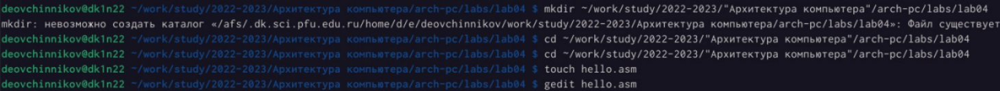
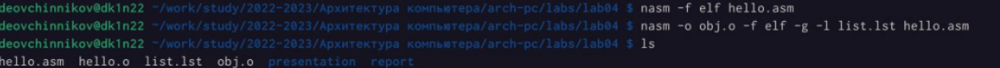
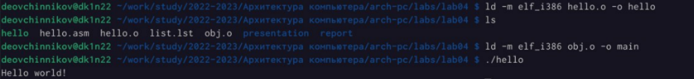
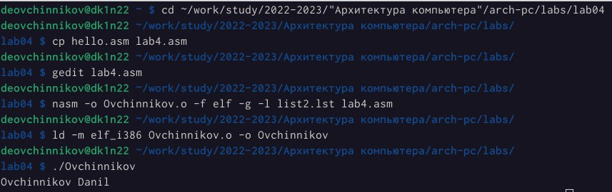

# Цель работы

Освоение процедуры компиляции и сборки программ, написанных на ассем-
блере NASM.

# Выполнение лабораторной работы

Создадим каталог для работы с программами на языке ассемблера NASM,
затем перейдем в созданный катало. Создайте текстовый файл с именем hello.asm.

{ #fig:001 width=90% }

Откроем этот файл при помощи текстового редактора gedit и введем следующий текст.

{ #fig:002 width=90% }

Скомпилируем полученный файл и сделаем компановку, проверим его.
Назовем и запустим этот файл.

{ #fig:003 width=90% } 

Заменим текст “Hello, world” на нашу фамилию и выполним компановку,
запустим программу.

{ #fig:005 width=90% } 

# Выводы

Я освоил процедуры компиляции и сборки программ, написанных на ассемблере NASM.

::: {#refs}
:::
